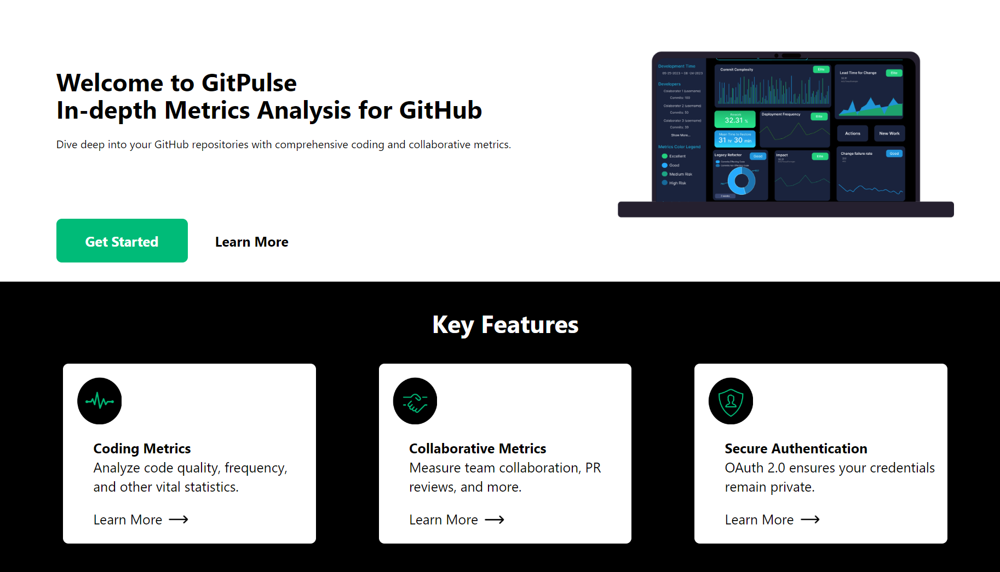

# Git Pulse Frontend

Welcome to GitPulse!

GitPulse is an application that provides insightful metrics and analytics for your GitHub repositories. This frontend repository contains the user interface components and interactions for GitPulse.



## Features

### Coding Metrics
Analyze code quality, frequency, and other vital statistics.

### Collaborative Metrics
Measure team collaboration, PR reviews, and more.

### Secure Authentication
OAuth 2.0 ensures your credentials remain private.

## Why Choose GitPulse?

GitPulse offers an intuitive platform tailored for developers and project managers alike. With a focus on transparency and security, we ensure your data is both insightful and safe.

- **Intuitive Design:** Easy-to-navigate dashboards and metrics visualization.
- **Top-notch Security:** Your credentials are never stored or shared.
- **Data Transparency:** Know exactly what data we access and how we use it.
- **GitHub Integration:** Seamless integration with your GitHub repositories.

## Table of Contents

- [Getting Started](#getting-started)
  - [Prerequisites](#prerequisites)
  - [Installation](#installation)
- [Usage](#usage)
- [Configuration](#configuration)
- [Contributing](#contributing)
<!-- - [License](#license) -->

## Getting Started

### Prerequisites

Before you begin, ensure you have met the following requirements:

- [Node.js](https://nodejs.org/) (version x.x.x)
- [npm](https://www.npmjs.com/) (version x.x.x)
- GitPulse Backend API up and running (Provide link to the backend repository)

You can check if you have Node.js and npm installed by running the following commands in your terminal:

```bash
node -v
npm -v
```
If these commands don't return version numbers, you'll need to download and install them.


### Installation

1. Clone this repository:

   ```bash
   git clone https://github.com/rahimaaa/SEMetrics.frontend.git
   ```

2. Navigate to the project directory:

   ```bash
   cd SEMetrics.frontend
   ```

3. Install the dependencies:

   ```bash
   npm install
   ```

## Usage

1. Start the development server:

   ```bash
   npm start
   ```

2. Access GitPulse in your browser:

   ```
   http://localhost:3000
   ```

3. [Add usage instructions...]

## Configuration

- Place this in your env file
```
    REACT_APP_BACKEND_URL = http://localhost:8080
```

## Contributing

Contributions are welcome! If you'd like to contribute to GitPulse, please follow these steps:

1. Fork this repository.
2. Create a new branch: `git checkout -b feature/your-feature-name`
3. Make your changes and commit them: `git commit -m 'Add some feature'`
4. Push to your branch: `git push origin feature/your-feature-name`
5. Submit a pull request.

Please refer to our [Contributing Guidelines](CONTRIBUTING.md) for more details.

<!-- ## License

This project is licensed under the [MIT License](LICENSE).
```

Just replace placeholders like `your-username`, `x.x.x`, and others with your actual information. Make sure to add actual content, screenshots, and specific instructions as needed to make the README meaningful for your GitPulse frontend application. -->